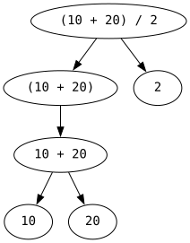

# Computations

You can use C++ to perform simple (or more complex) computations.

In addition to printing strings in quotes `std::cout << "Hello!";`,
you can also print numbers without quotes: `std::cout << 42;`.

But more generally you can print **expressions**:
```cpp
#include <iostream>

int main()
{
    std::cout << "The value is " << (10 + 20) / 2 << "\n";
}
```
This prints `The value is 15`. Notice that we're using multiple `<<` in one statement, this is fully equivalent to using multiple individual statements.

`(10 + 20) / 2` is an expression. Informally, **expressions are sequences of operands of operators**.

**Operators** are the symbols representing mathematical operations, such as `+`, `-`, `*` (multiplication), `/` (division), and more.

**Operands** are what an operator applies to. In `(10 + 20) / 2`, the operands of `+` are `10` and `20`, and the operands of `/` are `(10 + 20)` and `2`.

The left operand of an operator will often be called its **lhs** (left hand side) and the right one its **rhs** (right hand side).

Experiment with printing different expressions. This already has some practical use.

> ## Exercise 1
>
> Try using C++ as a fancy calculator. E.g. look up the number of days in each month, add them together using C++, and confirm that they sum to 365.

## Literals

The text between `"..."` quotes is printed literally, as is (except for [escape sequences](./01_your_first_program.md#n-escape-sequence)). For example, `std::cout << "10 + 20";` prints `10 + 20`, not `30`.

Therefore a piece of quoted text (such as `"10 + 20"` or `"Hello, world!\n"`) is called a "literal", more specifically **a string literal**.

Numbers such as `10`, `20` are also literals, more specifically **integer literals**.

Literals are values spelled directly in the source code, as opposed to being computed or obtained from elsewhere.

`10 + 20` is not a literal. Only the individual numbers in it are literals.

## Expressions are composable

Expressions often have other expressions as their parts. In the expression `(10 + 20) / 2`, the parts `(10 + 20)` and `2` are themselves expressions. And so are `10 + 20`, `10`, and `20`.

[](../images/subexpressions.svg)

Notice that individual numbers (literals) are also expressions.

The entire `std::cout << "The value is " << (10 + 20) / 2 << "\n"` (not counting the `;`) is also an expression. `<<`s are operators. Quoted strings are expressions.

Expressions that are parts of other expressions are called **subexpressions**.

Expressions that are not parts of other expressions are called **full expressions**.

`std::cout << "The value is " << (10 + 20) / 2 << "\n"` is a full expression, and every other expression in it is a subexpression.

If you've been paying attention, you should realize that a (full) expression followed by `;` is a statement (though there are other kinds of statements that will be discussed later).

> ## Exercise 2
>
> Write the first example from this chapter on a piece of paper. Circle every operand in it. Then circle (perhaps with a different color) every expression in it. Then circle every statement in it.
