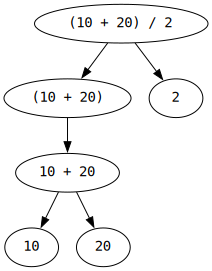

# Computations

You can use C++ to perform simple (or more complex) computations.

In addition to printing strings in quotes `std::cout << "Hello!";`,
you can also print numbers without quotes: `std::cout << 42;`.

But more generally you can print **expressions**:
```cpp
#include <iostream>

int main()
{
    std::cout << "The value is " << (10 + 20) / 2 << "\n";
}
```
This prints `The value is 15`. Notice that we're using multiple `<<` in one statement, this is fully equivalent to using multiple individual statements.

`(10 + 20) / 2` is an expression. Informally, **expressions are sequences of operands of operators**.

**Operators** are the symbols representing math operations, such as `+`, `-`, `*` (multiplication), `/` (division), and more.

**Operands** are what an operator applies to. In `(10 + 20) / 2`, the operands of `+` are `10` and `20`, and the operands of `/` are `(10 + 20)` and `2`.

The left operand of an operator will often be called an **lhs** (left hand side) and the right one an **rhs** (right hand side).

Experiment with printing different expressions. This already has some practical use.

## Exercise 1

Look up the number of days in each month, then add them together using C++. Confirm that they sum to 365.

## Expressions are composable

Expressions often have other expressions as their parts. In expression `(10 + 20) / 2`, the parts `(10 + 20)` and `2` are themselves expressions. And so are `10 + 20`, `10`, and `20`.

[](../images/subexpressions.svg)

Notice that individual numbers are also expressions.

The entire `std::cout << "The value is " << (10 + 20) / 2 << "\n"` (not counting the `;`) is also an expression. `<<`s are operators. Quoted strings are expressions.

Expressions that are parts of other expressions are called **subexpressions**.

Expressions that are not parts of other expressions are called **full expressions**.

`std::cout << "The value is " << (10 + 20) / 2 << "\n"` is a full expression, and every other expression in it is a subexpression.

## Exercise 2

Write the first example from this chapter on a piece of paper. Circle every operand in it. Then cirlce (perhaps with a different color) eveyr expression in it.
